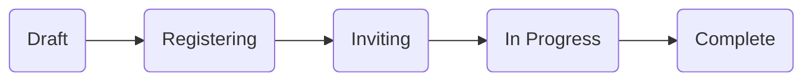
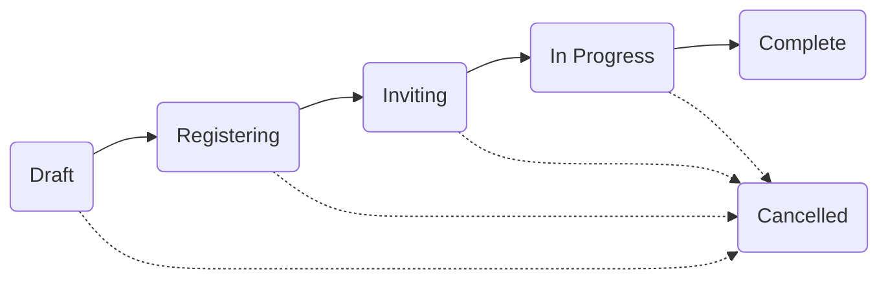

This is a development diary for the `bridge` project I'm working on, described in detail in my post:

[A Clojure learning journey](/2018/02/18/a-clojure-learning-journey/)

Since then, I've written other dev diary entries:

- [Bridge dev diary: Datomic mode](/2018/03/03/bridge-dev-diary--datomic-mode/) — 3 March, 2018
- [Bridge dev diary: Modelling access](/2018/03/17/bridge-dev-diary--modelling-access/) — 17 March, 2018

Today's diary entry covers the [changes in this diff](https://github.com/robert-stuttaford/bridge/compare/3d9ce59b58eeed4d7ee2b86217c1746b1b6a424c...7f2b0822ae6837589b584f9f07cf58d472ef7a37).

<hr>

*A small preface: I'm discovering that it's amazing just how much better your code gets when you write about it. I ended up doing [quite a bit more](https://github.com/robert-stuttaford/bridge/compare/7007fcd65b6f676a5b8df79056f4560b89e95b28...7f2b0822ae6837589b584f9f07cf58d472ef7a37) to organise code, rename things and generally make things consistent in the code during the writing of this post.*

*I highly encourage you to try it some time: the next time you finish writing some code, write a post to your colleagues explaining what you did, and why. See what happens to your understanding, and, what happens to the code! :-)*

*Please let me know how it goes for you, if you do actually this!*

<hr>

*A small warning: this is a very long, dense post!*

*You might want to bookmark this post to read in several sittings :-)*

<hr>

[TOC]

<hr>

## Dealing with events

My current programming goal here is for an organser to be able to:

1. Create a new event
2. Alter an event's details

My guiding UX principle is to ask the user to commit to as little as possible in any given interaction. 

Ok, that sounds pretty abstract. How does this play out in practice? 

- Create a new event: only ask for the essentials - title and start/end dates. We'll infer sensible defaults for other mandatory fields from these.
- Alter an event's details: be able to update each field in place, rather than re-submitting a form with all the fields possibly changing.

This makes each of these interaction small, and therefore easy to reason about, and to provide fast feedback to the user for. 

It also makes it easy for the user to make corrections — to undo any recent change — by doing the same thing, but in reverse. 

### The approach I've taken

On the surface, those two use-cases are quite simple — after all, we've all built CRUD apps before — it's just two forms, right? 

Rather than using that excuse to quickly trot out messy-but-working `add-event` / `edit-event` forms, I decided to slow down, and consciously build each layer up, one by one. 

To give myself the space to establish good patterns for dealing with all the concerns involved in shepherding user data from the browser to the database, and back out again. 

Concerns like authorisation and error handling, but also, things like how the code is organised, consistent use of naming conventions, and things like that.

I reasoned to myself that once I had done all of this for two or three use-cases, adding more use-cases will go much faster, because I would be able to lean on the abstractions I had built up.

It has been a really rewarding process to consciously slow down like this, and deliberately piece these things together. I've had tremendous fun.

Here's to hoping that it allows me to move quickly later, as I lean on this foundational work!

### Layers

Here are the layers that have emerged as I've chewed on these two cases:

1. [Datomic schema](https://docs.datomic.com/on-prem/schema.html) — the 'bottom'
2. [Specs](https://clojure.org/guides/spec)
3. Functions, each with their own example unit-tests:
   1. Queries to establish permission
   2. Validate inputs
   3. Make transactions
   4. Commit transactions
   5. Normal data queries
   6. API layer to compose all of the above
   7. HTTP interaction with the API — the current 'top'

Keep an eye out for these layers as we go through what's been added since last time.

<hr>

## People: a small update

I didn't feel that I was quite done with the code I wrote last time.

### Naming things correctly is important

First, I had a name to fix. 

I had named the `valid-password?` function using the Clojure convention of using a `?` suffix for naming predicates (which return either `true` or `false`), but in fact, this function returned either an error keyword or `nil`. I renamed it to  `check-password-validity` instead.

Incidentally, you absolutely must read [Elements of Clojure](https://leanpub.com/elementsofclojure) by [Zach Tellman](https://twitter.com/ztellman) — the first chapter on Names is _so good_!

### Example tests

Then, I also decided not to let any technical debt accrue, and made sure to add [example tests](https://lispcast.com/unit-testing-in-functional-languages/) for all of the functions that are used by our [access pages](/2018/03/17/bridge-dev-diary--modelling-access/#modelling-people).

While doing this, some basic testing patterns emerged pretty quickly, which I've since reused:

- Using 'constant' `def`s for commonly used test values; e.g. `TEST-EMAIL`, rather than hardcoding the actual values everywhere.
- Using a no-arg function to wrap invocation of `new-person-tx`, so that Spec instrumentation can report on issues. Previously, I had `def`ed this result as a constant value, which unfortunately happens while instrumentation is not enabled.
- Mocking impure functions that generate random data, like `nonce`, by wrapping a call to the actual function with `constantly`. This means I still test the actual function, even if just to generate a value for testing other things later!

I also tremendously enjoyed using the slick tooling [CIDER provides for testing](https://cider.readthedocs.io/en/latest/running_tests/). Being able to `run-last-failing-test`, `run-tests-for-this-ns`, and `run-all-tests`, and get quick feedback without disrupting what I'm editing, made keeping working tests updated very easy to do.

<hr>

## New entity: Chapters

Once I had done my first pass with Events (which I'll get to later), I recognised that I had to model Chapters too. I needed a way to model the check we need to do to see whether the active person may create events. 

I decided to model just enough about Chapters for it to be useful in this way, and to be consistent about covering all the same bases I had just done for our Person entity — that is, to ensure that we have schema, specs, a data namespace, and example tests.

### Chapter schema

So, now I have the following schema:

**`:chapter/title` — string** and **`:chapter/location` — string**

So that we have a name, and a way to record suitable geographical info.

**`:chapter/slug` — unique string**

A common web pattern is to store an identifier suitable for use in web URLs, rather than to expose an internal database ID directly. 

Given that we know we'll be doing a lot of stuff in the context of a chapter, we'll need one of those here.

#### URL slugs

Rather than re-invent the wheel here, I looked around to see what others had done, and found [Slugify](https://github.com/rlander/slugify) by [Rodrigo Landerdahl](https://twitter.com/rlander), which is *6 years old*, but still perfectly capable! 

I particularly liked that it dealt with non-ASCII characters, by using Java's `java.text.Normalizer` ([reference](https://docs.oracle.com/javase/7/docs/api/java/text/Normalizer.html)).

I didn't quite like the API Rodrigo came up with, and also didn't need to parameterise the delimiter, so I copied his code and tests, and reworked them to suit my tastes. I've kept a comment refering to his library, however.

I also wrote a generic regex-backed slug spec for my entity specs to use.

**`:chapter/status` — enum keyword**

As with Person, this gives us a way to easily disable a Chapter without having to retract data. I've since realised that I like this approach due to that UX principle I mentioned above - it's easy to toggle between two enum states.

**`:chapter/organisers` — ref, many**

Our first entity relationship! This opened up a fun Spec rabbit-hole...

#### Spec'ing Datomic references

… and when the dust settled, I had (just enough) specs for my use of Datomic's transactions and pull results. 

Currently, this includes:

- Datomic database - using `instance?` (Peer) and `satisfies?` (Client)
- Temp ids - the simple string type, as well as those with partitions
- Storage ids - i.e. normal longs
- Lookup refs
- Nested maps
- Collections of all the above, for use with cardinality-many refs

These are all used to spec functions that take Datomic databases and/or lookup refs, deal with creating transactions, and with returning pull results. 

By no means do I consider them to be an exhaustive coverage of the Datomic data API, but then, I don't need them to be. All I want is to be sure that *my* transactions and pull results are ok. I'm pretty sure they'll undergo tweaks and extensions as I cover more use-cases.

The nice outcome of all this work is that the combination of `s/fdef` to instrument my functions, and my example tests, means that I need to do very little to verify data _inside_ the functions themselves, keeping them easy to reason about.

### Chapter behaviours

We apply the patterns we've already established when we did Person:

- `new-chapter-tx` - transaction.
- `save-new-chapter!` - commit.
- `chapter-id-by-slug` - query.
- `dev-data` code to easily construct a Chapter, passing in our pre-existing dev-data Person as the sole organiser.

And we add new capability to support authorisation further 'up':

- `person-is-organiser?` predicate, which verifies a given person as an organiser for a given chapter — or not.
- `check-chapter-organiser` validation function, which models the error condition for this predicate.

Of course, all of these behaviours come with example tests!

#### The `check-n` pattern

As we saw with the choosing of a better name for password validation above, I established a bit of a norm, arranged around the `check-n` function name pattern.

In essence, a function with this prefix is expected to return error info if the check fails, or `nil` if the check succeeds. 

This way, using `nil` for success means that we can chain multiple `check-n` functions together with `or`, with the actual business logic taking the last spot in that `or`:

```clojure
(or (check-something)
    (check-a-different-thing)
    (do-or-query-something-safely))
```

See if you can spot the two places in the code where I use this pattern.

#### Giving error conditions their own names

I also decided to be specific about the shape of that error info. It should either be a simple keyword, or a map with an `:error` key + keyword value. 

As an experiment, I added a spec for this error shape, to ensure that this error keyword value has both 'bridge' and 'error' in its namespace, which allows error values like:

- `:bridge.error/some-generic-error`
- `:bridge.chapter.error/some-chapter-error`

My hypothesis is that this is going to force me to fully think through my error conditions, whenever I write any code in that direction, because I'm going to have to be intentional about *naming* those conditions.

I'm planning to consume those error value names on the client later, to provide fine-grained feedback to the user.

<hr>

## New entity: Events

On to modelling events!

### Event schema

**`:event/title` — string** and **`:event/slug` — unique string**

Same as with Chapters - identity on the page and in the URL.

**`:event/status` — enum keyword**

Because events model something that's time-bound (rather than a long-lived real-world entity), the 'active / deleted' pattern doesn't really apply here.

Rather, an event can be one of six states:

- **`:status/draft`**: It's not yet ready for the public to know about.
- **`:status/registering`**: The event is public, and accepting registrations.
- **`:status/inviting`**: Registration has closed, now finalising participants.
- **`:status/in-progress`**: The event is happening right now!
- **`:status/complete`**: It's done, all the cake has been eaten, and there are several new Clojure programmers in the world!
- **`:status/cancelled`**: Something unexpected happened — it's no longer going to happen.

The status progression for successful events looks like this:



However, reality is often unkind; it's possible for events to be cancelled. This could happen for many reasons, almost all of which are outside of the scope of this app, so unless an event has already concluded, we'll simply allow an event to be cancelled at any time.

Of course, we'll make very sure to have the organiser confirm cancellation, because we won't allow this to be undone. Why? We plan to automatically send emails to everyone involved when this happens.

Here's the updated diagram, with cancellation included:




**`:event/chapter` — ref**

We set this once when creating the event, and never change it.

**`:event/organisers` — ref, many**

Just as chapters have organisers, so too do events.

**`:event/start-date` — inst** and **`:event/end-date` — inst**

The all-important scheduling info. Some ClojureBridge events can be 1-day events, and so we allow these dates to be identical.

However, we ensure that the start is never *after* the end, with a spec — a simple Clojure predicate function over the `new-event-tx` map.

**`:event/registration-close-date` — inst**

We track when registration closes separately to the event start date. As with start and end date above, we have the same relationship between the registration-close and start dates - that is, it's possible for all _three_ dates to be the same day, but, again — not for them to be out of natural time order. 

So our spec predicate function described above actually specifies the relationship between all three dates.

**`:event/details-markdown`** and **`:event/notes-markdown`**

We have two free text entry sections for each event; one for the public to see (details), and a private one for the organisers (notes). I make it explicit that our system expects Markdown in these strings, by including it in the name.

Both are totally optional, but the idea is that the public details will be used to share all the logistics with participants - the event's agenda, where to park, the secret password to use at the door, where to find the cake, and so on.

By using Markdown, we don't have to worry about structuring this information in the database, which means that any of it is optional, and the format used is up to the author. They could even use images, if they took care of the hosting.

This allows me to sidestep a lot of fiddly programming to deal with many fine-grained optional fields, for now. It's completely possible that we'll find that some of the things people put in here actually need to become mandatory, in which case we'll lift it to its own dedicated Datomic attribute, with all its attendant code.

*By the way: those graphs above are rendered from data — view the source! Check out [mermaid](https://mermaidjs.github.io/) if you want to easily construct graphs like this yourself.*

*The Markdown editor I use, [Typora](https://typora.io/), has built-in support for Mermaid, which made writing those graphs a breeze!*

<hr>

### Event behaviours

As with Person and Chapter:

- `new-event-tx` - transaction.
- `save-new-event!` - commit.
- `event-id-by-slug` - query.

I don't have `dev-data` code, yet. I will do this once I move on to the next thing *after* events, which is likely to be event registration.

And, as with Chapter, authorisation helpers:

- `person-is-organiser?` predicate, which verifies a given person as an organiser for a given event — or not.
- `check-event-organiser` validation function.

Finally, we have one new function type; a Datomic pull, which simply declares what data will be provided whenever we are asked for an event's details. 

This is named `event-for-editing`, because I wanted to be clear about the context for use; in this case, the details include the organiser-only notes markdown.

Of course, all of this stuff also comes with example tests.

<hr>

<div class="tldr">

## *Intermission*

Wow - you're past the 2,500 word mark!

If you're reading this in a single sitting, now's a great time to rest your eyes for a minute, have a stretch, and maybe even refresh your drink.

It's OK — I'll wait for you :-)

</div>

<hr>

Are you back? Do you have a refill? Ok, let's continue...

<hr>

## Events API

The API layer's job is very similar to the Controller from the MVC world, in that it *composes* together the sequence of transformations, queries and transactions that make up our business logic, and to *give those compositions names*.

At the beginning of this short novel you're reading, we spoke of the principle of making changes small and easy to reason about. Here's where that principle directly applies to how we're writing the code. 

I came up with three API calls that our eventual client app will use:

**`save-new-event!`** 

Simply composes functions from the layers further 'down' that I've described above, with as little extra ceremony as possible:

1. `check-chapter-organiser`  — the event doesn't exist yet, so we have delegate authority to the chapter instead.
2. `save-new-event!` .
3. return `event-for-editing`.

Through the keys it expects in the context from the client, the following inputs are named: the active person, a chapter id, and the minimum details necessary for creating a new event.

**`event-details`** 

Composes:

1. `check-event-organiser` — now we have an event, we can check that instead of the chapter.
2. return `event-for-editing`.

Inputs: the active person, and the event's id.

**`update-field-value!`** 

Composes:

1. `check-event-organiser`.
2. `update-field-value!` — a new abstraction, described later on.
3. return `event-for-editing`.

Inputs: the active person, the event's id, and the field update.

— 

In all cases above, we end by returning the full pull result, so that we can ensure that the client-side state can be brought into sync with what's in the database.

Given that I haven't actually written the client yet, this may change, but for now, it'll do — it tells the story "Ok, I've done that, here's what I have, now."

Before I talk about that new `update-field-value` abstraction, let's cover how the API layer meets the Web.

<hr>

## API request handler

This is our current 'top' layer.

I want to be able to invoke the APIs described above without having to deal with the HTTP abstraction. 

I want to use namespaced Clojure keywords to name my APIs, rather than HTTP routes. When I've used HTTP routing tables to name API endpoints in the past, it's often turned into a mess, because I'm having to do battle on two fronts: using HTTP semantics correctly, and accurate description of my domain.

I prefer to do it with plain Clojure instead, which makes for easier testing — because writing actual tests is easier, and I also stay inside the REPL a lot longer, because I get to avoid the browser for a little longer.

To that end, I created a _single_ [Ataraxy](https://github.com/weavejester/ataraxy) route, `/client/api`, which will receive all the client's API calls as HTTP POST requests. 

It takes care of the following:

1. Constructs a context for those API calls, by merging all of the below into a single map:
   - Datomic connection and database, from the request.
   - User identity, from the request session.
   - The POST body data, read as EDN, which is expected to be a map.
2. Invokes an `api` multimethod, which dispatches on the value of  `:action` in the context produced by 1 above. Given that we're defining an API, we'll throw an exception if this action doesn't dispatch.
3. `api` returns normal Clojure data, which the API request handler will print to EDN and return as the response body.

By doing it this way, I've moved all of this construction, parsing, and printing to a single place, and away from my individual API implementations — just like a good abstraction should.

Later, when it's time to think about performance, I'll introduce [Transit](http://blog.cognitect.com/blog/2014/7/22/transit) here, once I have a production environment to configure for.

### Authentication as middleware

I refactored one other thing, too — I moved the `buddy/authenticated?` conditional that the client page had, up to an Ataraxy middleware function, which is referenced by the root service.

Each handler that requires this behaviour can now be decorated with `^:authenticated?` metadata in the Ataraxy route map. 

In this way, the base client page and the API request handler now use identical basic authentication logic.

<hr>

## Modelling fine-grained updates

I knew that I wanted to be able to update events one element at a time, with an edit-in-place type experience. To get a sense of what that'd look like at the API layer, I wrote up some notes next to a listing of the schema:

```clojure
:event/title ; required
:event/slug ; unique
:event/status ; [<next state>] [cancel], both with confirm
:event/chapter ; can't edit
:event/organisers ; add/remove, must be at least one
:event/start-date ; picker, < end
:event/end-date ; picker, > start
:event/registration-close-date ; picker, < start
:event/details-markdown ; can be blank
:event/notes-markdown ; can be blank
```

Just reading through those notes, I am sure you can see how I arrived at some of the conclusions I've already shared above.

### Building a validation chain

That `:event/chapter` is unchanging, showed me that I needed to be specific about which attributes are allowed to be changed. 

But, rather than letting that lead me to conclude that I needed a 'set-x' workflow for each attribute, and decided instead to handle that with a simple attribute whitelist instead.

To code this, I started with a generic update function, which would use `cond` to keep trying validations until either one failed, the first one being that whitelist check.

Next, I added a spec-based validation check, where I first test to see if a spec is registered (with `s/get-spec`), and if it is, explicitly test with `s/valid?`.

After that came the need to deal with uniqueness. Again, rather than copping out to a specially named function for this one attribute, I knew that I can query the database to ask whether uniqueness mattered, and if so, perform a generic validation from there.

Then, to validate attributes that use references, I used the same trick to query the database schema, and then used `datomic/entid` to check whether the referent exists.

What you just read above reads like a neat linear narrative, but it's true that I jumped around, refining specs, writing tests, and generally fixing small but incorrect assumptions throughout the code, as I wrote these generic validations.

Ok, so, so far, we have this:

1. Whitelist — does the system allow alterations at all?
2. Spec — if we have a spec, is it valid?
3. Uniqueness — if it needs to be unique, is it?
4. Reference — if it needs to exist as an entity, does it?

### Reifying the update context

At this point, I had the following inputs:

- Database
- The event's id
- The attribute
- The value we're trying to set

I had all of these as positional function arguments. Seeing `event-id` next to otherwise generic code made me realise that there's a small context to bring together here. So I put all but the database into a map, and wrote specs for the keys, and how they are to be composed. The client will be able to use those later.

This, I think, is what people mean when they say Clojure is 'data-oriented'.

### Custom validators

Ok - I still had some validations to deal with. I needed a way to ensure that status changes were according to the rules in the diagrams we saw further above, and I also needed a way to ensure that we never remove the last event organiser.

These are both pretty specific, and I felt they should have their own distinct implementations, but I didn't want them to be inside my nicely generic validation function. 

So, I added another layer of indirection: a `check-custom-validation` multimethod, which dispatches on the attribute name, and which is only attempted after all other validations pass. Then, I wrote implementations to ensure that status changes only occur in the agreed ways, and that you can't remove the last organiser.

I later recognised that these custom functions actually compared the incoming data to what was already present in the database for this entity, which is something that a generic system like spec will never be able to do (and nor should it!)

### Refactoring for consistency

Given that I was doing this, I recognised the now familiar `check-n` pattern in place, and moved all of the generic logic above out to their own named `check-n` functions, all nicely named and tested, and composed together with `or` into a 'master' validation function.

### Actually updating the heckin' database

So, after all of that, all I ended up with was greater certainty that my intended changes can be committed. I still had to actually transact something.

Aside from retracting organisers, all of my updates are assertions. So, expressing that was straightforward. I added a `retract?` option to the update context, to allow the client to express retractions for the remove-organiser case.

Also, because those markdown fields are optional, it's possible for an organiser to blank out a previously populated notes area, thereby 'retracting' its contents. So, I made sure to catch an incoming blank string assertion, and to instead treat it as a retraction.

It's safe to do this automated retraction because our specs in validation step 2 ensure that we don't let any blank strings through, unless they're allowed.

<hr>

## Various other updates

### Spec code organisation

All specs now live in `spec.cljc` files, so that they can easily be used from ClojureScript later. 

I decided to standardise on moving all the `s/fdef` function specs to directly beneath the function being specified.

The folder in which each `spec.cljc` file lives denotes its context. For example, the general Datomic specs live in `bridge.data.datomic.spec`, whereas Chapter specs live in `bridge.chapter.spec`.

Given that we include date comparison in that one spec for events, I had to use reader conditionals to provide platform-specific date comparison implementations: Clojure uses `clj-time`, and ClojureScript uses `goog.date.Date`.

Finally, you may notice that I have `(require 'some.spec)` in several places, rather than including them in the `(ns)` form. 

This is simply because an Emacs package I use, [Clj-Refactor](https://github.com/clojure-emacs/clj-refactor.el/), strips them out of the `(ns)` form every time I use [clean-ns](https://github.com/clojure-emacs/clj-refactor.el/wiki/cljr-clean-ns), because it can't find any references in the rest of the namespace, which causes 'undefined spec' errors. 

So, I use separate `require`s to ensure that they are loaded into memory at the right time, and continue to `clean-ns` early and often. 

It's a small price to pay, all things considered!

### Tests

The example tests for Chapter and Event required standard fixtures for People and People+Chapters, respectively. Once I saw these being duplicated a couple times, I moved these to a common fixtures test namespace. 

It's very similar to that dev-data namespace, actually!

### Client

I stubbed out a sticky top navigation bar, with:
- Events: list-events, add-new-event buttons.
- Session: active person name, logout button.

To support this, I also updated the server template to include the active person's name in the initial client state.

### Dependencies

- Added [depot](https://github.com/Olical/depot), a new Clojure CLI library for finding outdated dependencies. I also included a `Makefile` command, `outdated` to easily invoke it.
- I updated all the dependencies except for Jetty, which needs to stay where it is to match the Jetty dependencies inside Datomic.


<hr>

Phew. This was a pretty big update.

As always, I'm looking to learn from others just as much as I am looking to share my experience. 

I'd _really_ love to know how any of what I'm writing here is helping you — however small or big.

If you have any advice, or questions, or feedback of any kind, please [get in touch](/)!

As always, thanks for reading!


<script src="https://unpkg.com/mermaid@8.0.0-rc.6/dist/mermaid.min.js"></script>

<script>mermaid.init({startOnLoad:true}, ".language-mermaid");</script>