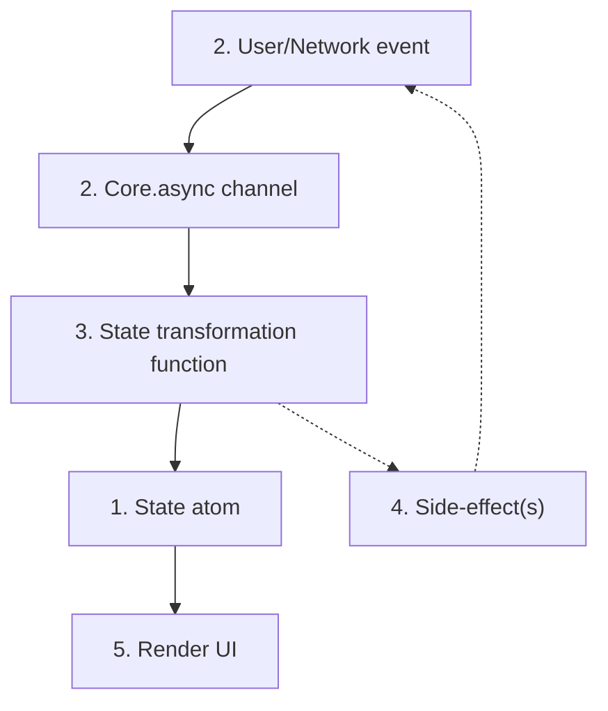
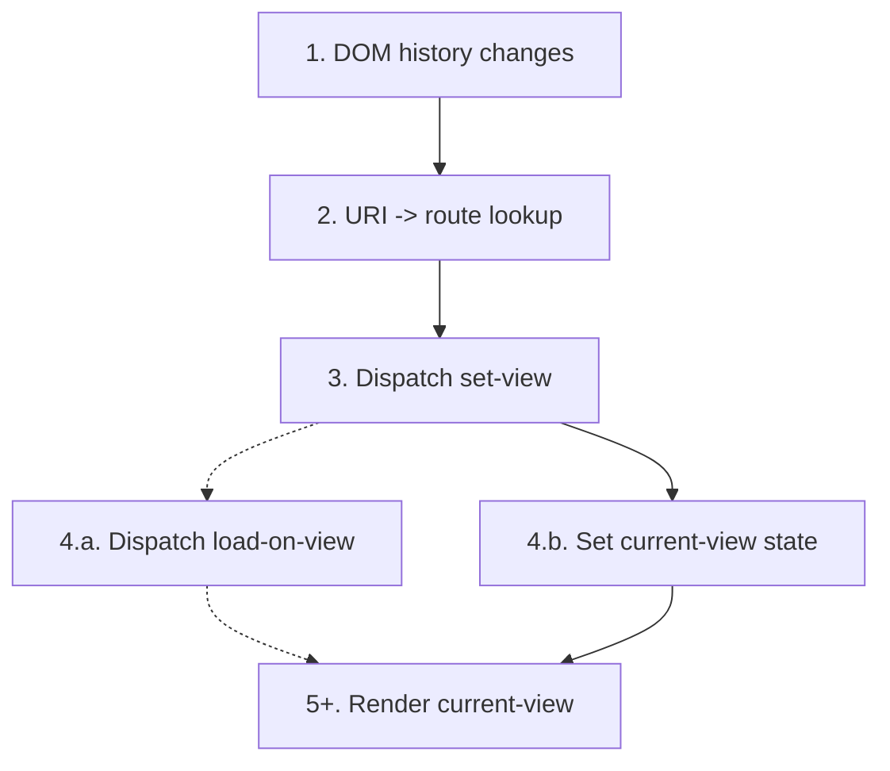

This is a development diary for the `bridge` project I'm working on, described in detail in my post:

[A Clojure learning journey](/2018/02/18/a-clojure-learning-journey/)

Since then, I've written other dev diary entries:

- [Bridge dev diary: Datomic mode](/2018/03/03/bridge-dev-diary--datomic-mode/) — 3 March, 2018
- [Bridge dev diary: Modelling access](/2018/03/17/bridge-dev-diary--modelling-access/) — 17 March, 2018
- [Bridge dev diary: Events API](/2018/03/31/bridge-dev-diary--events-api/) — 31 March, 2018

Today's diary entry covers the [changes in this diff](https://github.com/robert-stuttaford/bridge/compare/c21851f...b599627).

<hr>

[TOC]

<hr>

Today's entry covers our first adventure on the frontend!

I set out to produce the essential UI for creating, listing, and editing events. I wanted to see all three working in unison, so that I had a 'closed' interaction loop.

## Choosing re-frame

I decided to use a library I had never used before: [re-frame](https://github.com/Day8/re-frame). Over the years, as I've looked at various open-source ClojureScript projects, Reagent has often been in the mix. I've often wanted to use components from these Reagent-backed projects ([data-frisk-reagent](https://github.com/Odinodin/data-frisk-reagent) comes to mind), but couldn't easily do so, because I was either using Om-not-Next, or later, Rum.

After seeing how much fun [Mike](http://twitter.com/wazound) and [Daniel](https://twitter.com/danielwithmusic) (and many other contributors) are having with re-frame and neat-o developer tooling like [re-frame-10x](https://github.com/Day8/re-frame-10x), I figured that this bridge project would be a great place to try these things out.

It turns out that it was a great choice!

I've really enjoyed it so far (despite a small speedbump along the way with 10x), and I'm quite confident that its design is going to scale well as bridge grows.

That design is very similar to something we use at Cognician, named Radiant (I'm a _huge_ [Stormlight Archive](https://brandonsanderson.com/books/the-stormlight-archive/) fan-boy, can you tell?). There's a trimmed-down version of Radiant powering the Clojure Codex (see [client* here](https://github.com/robert-stuttaford/stuttaford.me/tree/master/src/stuttaford)).

It's a very common pattern in the ClojureScript world, which (I have it on good authority, the Javascript folks go through great ritual to reproduce):

1. One top-level state `atom`.
2. One `core.async` channel which serialises all inputs, whether from the user or the network.
3. A function which reads from that channel, using a keyword to dispatch some registered handler, which returns a new state to `swap!` into the atom.
4. Some mechanism for running side-effects in a controlled manner. Radiant allows the `state->new-state` functions from 3 to accrue effects as data in a vector, which then get invoked after the state update via `doseq`. If needed, it's expected that effects will place more inputs into the `chan` at 2, typically via callbacks.
5. A React wrapper subscribed to the atom, turning Hiccup + data into React components.

Here's a flowchart:



The whole point of all of that being: state changes happen in serial, and the state change mechanism is totally decoupled from the UI rendering mechanism. This is often referred to as 'uni-directional data-flow', which is proof that nerds can't help themselves some time.

*\*polishes Nerd badge\**

Re-frame does pretty much this; what's interesting about it is how it handles 2, 3 and 4 - it brings the full power of [finite-state machines](https://en.wikipedia.org/wiki/Finite-state_machine) and [interceptors](http://pedestal.io/reference/interceptors) to bear on the problem, making it capable of modelling substantial complexity.

I'm not going to cover how re-frame does its thing here - there are plenty of resources out there:

- [re-frame itself has extensive documentation](https://github.com/Day8/re-frame/tree/master/docs/README.md). The "6-domino" cascade described in its README maps very closely to the flowchart above.
- [Arne Brausser](https://github.com/plexus) has [LambdaIsland screencasts and articles about re-frame](https://lambdaisland.com/episodes/re-frame).
- [Eric Normand](http://twitter.com/ericnormand) has a regularly maintained guide here: [The Re-frame Building Blocks Guide]( https://purelyfunctional.tv/guide/re-frame-building-blocks).

There are no doubt plenty more out there to find!

### That speedbump: re-frame-10x

I did bring this fantastic tool into my project, but for some reason, there's a [dodgy interaction](https://github.com/robert-stuttaford/bridge/pull/3) between it and the `tools.namespace` refresh process.

Daniel is aware of it, but he's a busy chap, and so rather than allow this weird, non-obvious bug to derail my efforts, I've decided not to use 10x for now.

I'm happy to park it and circle back in a couple months!

<hr>

## Bootstrapping the ClojureScript app

This section covers all the stuff that sits between the browser and Actual Features in our client app. The section that follows after that will talk about how the Events UI sits on top.

The base application is an integration layer, which brings together the following:

- Some developer tooling
- State initialisation
- Routing
- The top-level view

### Developer tools

First, a couple developer conveniences.

I added [binaryage/cljs-devtools](https://github.com/binaryage/cljs-devtools). This makes logging Clojure data structures as nice as logging JavaScript ones.

Just as with server-side development, I also switch on Spec asserts and Expound error printing. This pays its rent in spades, as we'll see below.

### State initialisation

The server-side view dumps some basic data for the client to work with, which is currently just some session data. We read it from the DOM as EDN, and hand it to re-frame to start the client database with.

I also set up some re-frame subscriptions to get at this session data.

<hr>

### Client-side specs

As I mentioned earlier, re-frame has a full interceptor chain built in. This allows us to set up middleware functions and declaratively compose them with our event handlers.

In reading through re-frame's docs, I came across an excellent application of this feature: automated client-database spec validation.

I started using namespaced keys for this initial data, and wrotes specs for it. Then I cribbed the [check-spec](https://github.com/Day8/re-frame/blob/master/examples/todomvc/src/todomvc/events.cljs#L49) interceptor from the todomvc example, and, as I developed the UI, I made sure that I had specs for all the data going into the client state.

Given that expound prints such nice, readable errors in the console when this happens, this ended up saving me **substantial** head-scratching time.

Of course, I had already invested in specs for most all the data when writing the APIs, so I was able to simply reuse those when doing this, which felt pretty damn good. Thanks, `cljc`!

So, this means that I have **one** specification for my data, and both the server and the client use it to 'fail fast' when data doesn't conform.

I hope the power of this is evident to you!

Just in-case it is not, let me state it clearly:

- Every client-side state **mutation only succeeds** if the resultant change **conforms to the spec** for the client-side database.
- This spec composes the **same specs the server uses** with additional specs to describe how the data is structured for the client to use.

How many times have you written `prn` and hit refresh because of bugs caused by the lack of this sort of assistance? I know I have done so far too many times!

So, if you take <u>one</u> thing away from this post, let it be this:

> *Write specs for your client-side data and use them<br> to validate data on every state transition!*

<hr>

#### Routing

As with any integration layer, client-side routing is the composition of several concerns:

- Wildcard server-side route, so that all `/app*` requests reach the same server-side handler, which then serves the client HTML and assets. The client app is responsible for dealing with `"*"`.
- Declaring our client-side routes. [bidi](https://github.com/juxt/bidi) handles this nicely; it allows me to compose the client's routing table together in the same way that it happens on the server side: by simply merging maps. This is important, because I want each app module to maintains its own routes, rather than having a large, central monolithic routes file.

  Because I've never written several of those. No _sir_.
- A re-frame [event dispatch](https://github.com/Day8/re-frame#1st-domino---event-dispatch) to transform the routing stimulus into data (more on this below).
- Interacting with the browser's mutable history API. We use  [pushy](https://github.com/kibu-australia/pushy), which connects browser events to the re-frame dispatch, after transforming them with bidi.


Most of this came from an excellent article by J. Pablo Fernández: [No-hashes bidirectional routing in re-frame with bidi and pushy](https://pupeno.com/2015/08/26/no-hashes-bidirectional-routing-in-re-frame-with-bidi-and-pushy). I really just massaged it into place!

#### Turbolinks

I added a [turbolinks](https://github.com/turbolinks/turbolinks)-esque helper, which allows me to use routing names like `:create-event` to produce the right Hiccup attribute map data to make a normal `<a href="/app/events/create">` link, but also provide it with an `:on-click` handler that directly invokes the routing machinery for that view.

This allows users to right-click links and Open in New Tab, but prevents a full page reload if simply clicked in the browser. It makes the app feel really fast, without losing the things that make it feel like a normal web page.

#### Trigger routing manually

I also added a re-frame side-effect [Effect Handler](https://github.com/Day8/re-frame/blob/master/docs/Effects.md#extensible-side-effects) which invokes the routing mechanism as though the user altered the address on the address bar.

This allows us to automate moving the user to a new view as part of a broader process. Currently, I use this to move the user to editing a new draft event immediately after creating it.

#### Route ⟶ State ⟶ UI

Once pushy has shared the routing stimulus with re-frame, we need it to affect the view.

First, we store the data in the state. This data has two parts: the route's name (as a keyword at `:view`), and any dynamic data from the url (as a map at `:params`).

We need to use this data to do two things: to update the view, and to load any data needed for that view. Because we'll be doing this for many different views, we need a dispatch mechanism, so that we don't end up exhaustively listing out all the views here.

Happily, we can use our old friend the multimethod for both of these, using the same `:view` value to dispatch on:

```clojure
(defmulti load-on-view :view)
(defmethod load-on-view :default [_] nil)

(defmulti view :view)
```

Any view that needs to load data can implement a `load-on-view` method, which must return a re-frame dispatchable event. The default is to return `nil`, which is how we make it optional.

And, view entry points are implemented as `view` methods, which must return valid React components.

By example, here's 'edit event' — see how they both use `event-slug`:

```clojure
(defmethod ui.base/load-on-view :edit-event
  [{{:keys [event-slug]} :params}]
  [::event-for-editing [:event/slug event-slug]])

(defmethod ui.base/view :edit-event
  [{{:keys [event-slug]} :params}]
  [bridge.event.ui.edit/edit-event event-slug])
```

The `view` method here defers to a separate namespace for the actual view code, defined as a Reagent component `bridge.event.ui.edit/edit-event`.

The `load-on-view` method is used by the same the event handler that the routing invokes.

Here's how all of that comes together, in the event that the routing invokes:

```clojure
(rf/reg-event-fx ::set-view
  [ui.spec/check-spec-interceptor]
  (fn [{:keys [db]} [_ view]]
    (let [load-on-view (ui.base/load-on-view view)]
      (cond-> {:db (assoc db ::current-view view)}
        (some? load-on-view)
        (assoc :dispatch load-on-view)))))
```

By returning a map with a `:db` and a `:dispatch` key, we give re-frame the instruction to both immediately update the client database, and trigger another event.

And here's all of that as a flowchart (because who doesn't love those!)



In this diagram, normal link visit starts at 1, and turbolinks and manual routing changes both start at 3.

Elegant!

<hr>

### Top-level view

The outermost view code is really quite straightforward.

It composes a navigation bar (which use turbolinks, of course) and a call to our `view` multimethod call into a cohesive layout.

<hr>

<div class="tldr">

## *Intermission*

Wow - you're past the 2,000 word mark!

If you're reading this in a single sitting, now's a great time to rest your eyes for a minute, have a stretch, and maybe even refresh your drink.

It's OK — I'll wait for you :-)

</div>

<hr>

Are you back? Do you have a refill? Ok, let's continue...

<hr>

## Events UI

### How this code is organised

All of the following are in a single 'root controller' namespace `bridge.event.ui`.

- Route definitions
- re-frame subscriptions
- re-frame effects, covering all the interaction data flows
- The `load-on-view` and `view` multimethod implementations

This one namespace has all of these for all three main event views. I may eventually split these out into individual namespaces per view.

The actual view implementation React components each live in their own namespace, e.g.  `bridge.event.ui.list` or `bridge.event.ui.create`.

Right now, it's nice to be able to see all of the 'glue' in one place, to see data access/update and data-flow patterns that can be extracted.

It's also nice to be able to put the controller code side-by-side with the rendering code I'm working on - which gives me another way to see the whole story for that view.

Regarding network interactions, I use the nifty [re-frame http-fx](https://github.com/Day8/re-frame-http-fx) effect handler to issue and respond to Ajax calls. I plan to add generic network error message handling in my wrapper code here.

<hr>

### Listing events

<figure><figcaption>Listing events</figcaption></figure>

When there are no events, invite the organiser to create one.

Show the event's title, its status, and the three dates that constitute its timeline — registration-close, start, and end. Click to edit.

#### Implementation notes

- Added new Events API `list-events-for-chapter`.
- Use `goog.i18n.DateTimeFormat` to format dates.

<hr>

### Creating events

<figure><figcaption>Creating an event</figcaption></figure>

According to our 'make small decisions' principle, we ask the organiser to enter the absolute minimum — event title, and start and end dates — and infer sensible defaults for the other mandatory event data.

To handle the remainder, we take the organiser to the edit-event view for the newly created event.

#### Implementation notes

Since the organiser has to provide all of these details at once, we use a single reagent [ratom](http://reagent-project.github.io/docs/master/reagent.ratom.html#var-atom) (a.k.a. reactive atom) to store the three form field values.

Each field updates the ratom on every change.

The submit button is disabled until the map inside the atom *conforms to the `new-event` spec*. As this spec composes the specs for the fields, this means that we allow only **complete** and **correct** data through.

We use Airbnb's _excellent_ [react-dates](http://airbnb.io/react-dates/) component to get the start and end date values. To do this, I used the [cljsjs](http://cljsjs.github.io/) wrapper [cljsjs/react-dates](https://github.com/cljsjs/packages/tree/master/react-dates) to bring in the JavaScript, and the [ring-cljsjs](https://github.com/deraen/ring-cljsjs) middleware to make serving the related CSS easy.

It's thanks to [Dave Della Costa](https://twitter.com/dubitable?lang=en)'s [react-dates-reagent-example](https://github.com/ddellacosta/react-dates-reagent-example) that I was able to integrate this easily.

<hr>

### Editing events

<figure><figcaption>Editing an event</figcaption></figure>

This UI, which then provides UI to manage all aspects of the event:

- Title, slug, start and end dates, and registration date
- Public details and private notes
- Event status. Here we can see the event status rules we covered last time nicely visualised.

#### Implementation notes

Wow. There's a lot going on here!

Editing events falls into two basic gestures - altering the event's status, or editing a detail field.

##### Event status

As described in [the previous post](/2018/03/31/bridge-dev-diary--events-api/#event-schema), event status follows a strict set of rules for how the value can change.

Here's how UI handles this. First of all, the full continuum (sans 'cancelled') is displayed as a progress view at the top of the page:


A helpful message is displayed beneath this bar, which describes the key thing that's happening with this event right now:

```clojure
(def status->description
  {:status/draft
   "This event is not yet public."
   :status/registering
   "Participants may register."
   :status/inviting
   "Registration is closed; awaiting confirmed invitations."
   :status/in-progress
   "This event is happening right now!"
   :status/complete
   "This event is all done!"
   :status/cancelled
   "This event is cancelled."})
```


And, if the event isn't complete or cancelled, there are two buttons at the top right of the page, which progress the event to the next status, or cancel it, respectively.

Either way, when the organiser chooses to do one of these, the organiser must confirm this action, as it can't be undone:

<figure><figcaption>Confirming event status changes</figcaption></figure>

##### Edit in place text field

Most of the event's fields are text entry:

- Title
- Slug
- Public Details
- Private Notes

They all use the same edit-in-place component, which handles everything about the edit experience: making, cancelling and committing changes, displaying 'dirty' and 'invalid' states, and connecting all of this to the re-frame data-flow machinery.

- **Editing vs display state**: the Markdown variant renders normal Markdown when you're not editing, and switches to a textarea when you are. The single-line textfield always displays the input.
- **'Dirty' state**: show when there's a new value to commit or discard. Provides "Save" and "Cancel" buttons, and wires up the Enter and Escape  keys respectively to do handle those gestures.
- **Invalid state**: disables the Save gesture, renders a red border and warning icon, and updates the placeholder with a description of the issue.

When the organiser commits an edit, we update the local state immediately, and send the network update in the background.

The edit-in-place field uses a set of configuration values, all collected together in a map under the `:field/*` namespace. Of course, these have specs, and the component will throw if the provided config does not conform.

<hr>

## Where to from here?

At this point, a fair amount of technical debt has built up.

### Technical debt

There's plenty of gaps in the unit tests. Happily, all the tests that we have right now do pass!

There are plenty of places where there's insufficient error-handling:

- There's no network error handling.
- None of the form interactions respond to server-side error messages.

A number of issues exist due to the fact that we use a user-managed unique attribute - the url slug:

- The create event form doesn't check for uniqueness conflicts yet.
- When editing an event, if you change a slug, the UI doesn't update its state, or the web url yet.

Editing events has some gaps, too:

- Extra logic needs to be written to ensure that the relationship between the registration-closes and start dates remains intact.
- It's not possible to manage the event's organisers yet.

And the usual culprit: all of the UI needs a responsive CSS polishing.

### Next steps

So, probably the next arc of work will be to pay most (or all) of this all of this tech debt down, so that the next set of features is built on top of firm foundations.

After that, we can begin work on the next key activity: event participant registration!

This will likely entail building the following:

- Public event pages
- Registration forms (for both participant and coach)
- Updating the backend to show registrants


<hr>

## Closing

As always, I'm looking to learn from others just as much as I am looking to share my experience.

I'd *really* love to know how any of what I'm writing here is helping you — however small or big.

If you have any advice, or questions, or feedback of any kind, please [get in touch](http://localhost:3000/)!

As always, thanks for reading!
